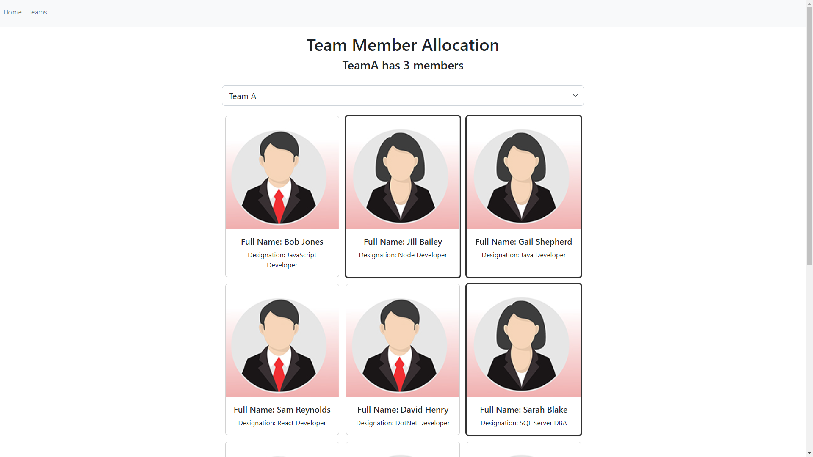

# Team Member Allocation App

## Created With:
- React
- BootStrap
- React Router
- Context API

## Links
- Live Site URL: [Team Member Allocation App](https://jolly-raindrop-2d89dc.netlify.app/)

## Project Screenshot

## Project Description

- Team Member Allocation App is a react application that lets you reassign team members to different teams just by clicking their employee card.
